# Image Completion/Inpainting using GAN (DCGAN)

Final project for [Columbia University W4731 Computer Vision with Professor Carl Vondrick](http://w4731.cs.columbia.edu/)

## Author
Eden Dolev

## Overview
Image completion (inpainting) using a DCGAN approach. Based on the paper [Semantic Image Inpainting With Deep Generative Models](https://arxiv.org/pdf/1607.07539.pdf) by Raymond A. Yeh, Chen Chen, Teck Yian Lim,
Alexander G. Schwing, Mark Hasegawa-Johnson, Minh N. Do. University of Illinois at Urbana-Champaign.

### Description
GANs can be used to pit two neural networks at each other: one (discriminator) to classify whether an image came from the dataset or not, and the other (generator) to learn how to fool the discriminator by generating fake images.
After training the GAN, inpainting on missing "blobs" in the image can be accomplished by using the trained models to learn which input to the generator results in the most suitable completed image.
When doing the completion, we keep track of both a "perceptual" and a "contextual" loss. The former keeping the generated image "realistic" and the latter adjusting the output to resemble the image we are trying to complete.

### Architectures
- Discriminator
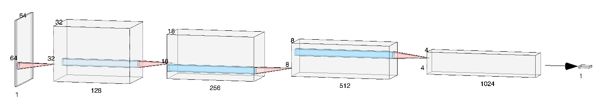

- Generator
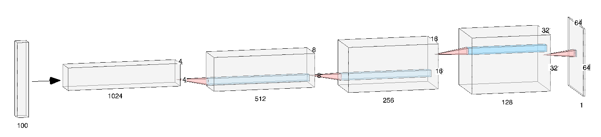

### Steps
- Training the GAN (`train_dcgan.py`)
- Running the completion algorithm (`complete.py`)

## Results
### Example Completion
| Original                          | Masked                         | Generated                         | Completed                         | Blended                         |
| :-------------------------------: |:------------------------------:| :------------------------------:  | :-------------------------------: | :----------------------------:  |
| 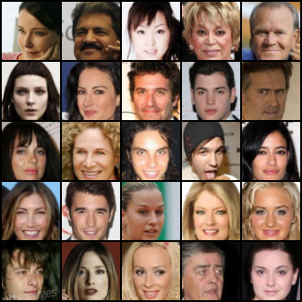  | 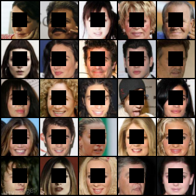 | 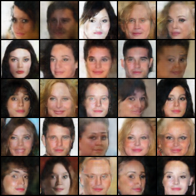 | 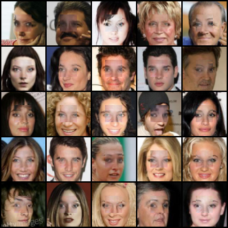 | 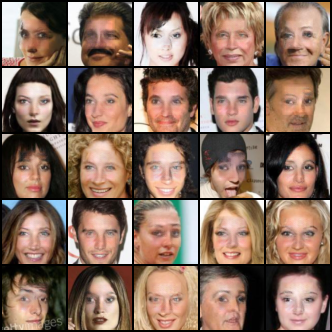 |

* `Original` is original image from the dataset
* `Masked` is the original image after mask applied to remove central part
* `Generated` is the fake image generated by the generator from which we crop out a filling for the masked image
* `Completed` is the masked image with a crop fill of the generated image pasted on it
* `Blended` is the completed image after applying alpha blending

### Training GAN

| Generated Samples Training Progression            | Discriminator Loss                         | Generator Loss                             |
| :-----------------------------------------------: | :---------------------------------------:  | :--------------------------------------:   |
| 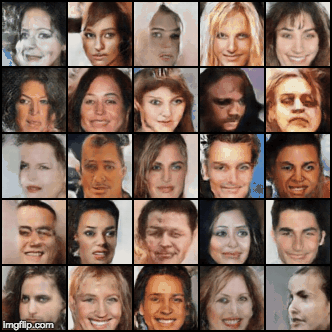            | 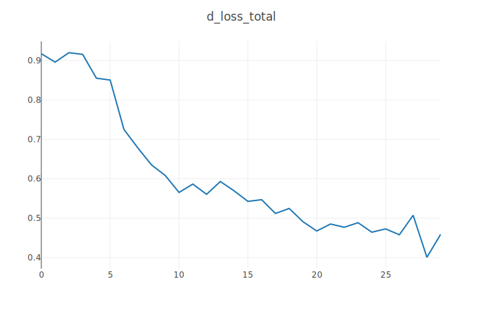     | 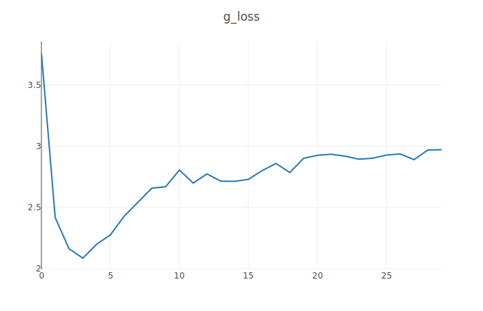     |
| 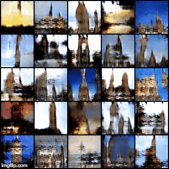        | 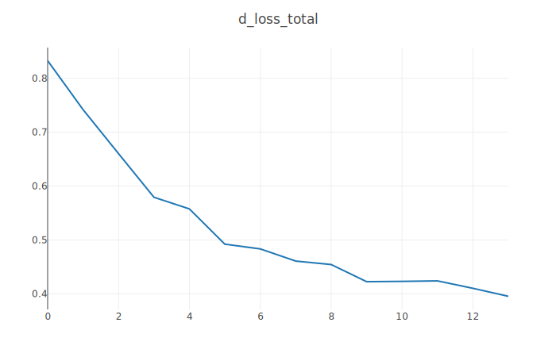 | 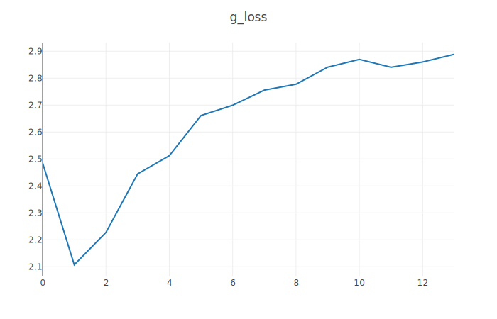 |

## Dependencies
```
python3
numpy
torch
torchvision
python-opencv
Visdom (optional)
```

## How to run

### Setup
- Install dependencies (see above)

- Set up dataset/s in `data` directory. Directory name should match dataset name in loader (`helper.py`) and should have at least one sub directory under that.
i.e.
```
root_dir
    |-data
        |-celeba
            |-faces
                |-face1.png
                |-...
        |-celeba_test
            |-faces
            |-...
```

- Create directory structure for checkpoint model saves, final models for completion, and output images for training and completion:
```
root_dir
    |-checkpoint
    |-models
    |-images
        |-training
        |-completion
            |-originals
            |-masks
            |-generated
            |-completed
            |-blended
```

- Before completion make sure to copy the saved models from the `checkpoint` directory to the `models` directory, from which `complete.py` loads the models

### Training
Example:
```
python3 train_dcgan.py --dataset=celeba --n_epochs=100 --img_size=64 --channels=3 --logging=True --batch_size=128
```
#### Params
- `use_cpu`: force cpu even if cuda available
- `dataset`: dataset we want to load for training. Loader defined in `helper.py`
- `n_epochs`: number of training iterations
- `lr`: optimizer learning rate
- `b1`/`b2`: optimizer beta decays
- `n_cpu`: number of cpus
- `latent_dim`: size of z vector (generator input)
- `img_size`: image size we want the loader to shrink our data to for training
- `batch_size`: size of image batch per training iteration
- `channels`: number of image channels
- `logging`: log images/losses to Visdom or not
- `log_port`: Visdom log port
- `sample_interval`: how often to save sample images during training

### Completion
Example:
```
python3 complete.py --dataset=celeba_test --n_iters=5000 --img_size=64 --channels=3 --logging=True --batch_size=128 --blend=True
```
#### Params
- `num_iters`: number of iterations to learn the z input for the generator
- `percep_coeff`: how important is the perceptual loss in the overall completion loss
- `num_batches`: number of batches to complete
- `blend`: apply alpha blending after completion
- `use_cpu`: force cpu even if cuda available
- `dataset`: dataset we want to load for training. Loader defined in `helper.py`
- `lr`: optimizer learning rate
- `b1`/`b2`: optimizer beta decays
- `n_cpu`: number of cpus
- `latent_dim`: size of z vector (generator input)
- `img_size`: image size we want the loader to shrink our data to for training
- `batch_size`: size of image batch per training iteration
- `channels`: number of image channels
- `logging`: log images/losses to Visdom or not
- `log_port`: Visdom log port
- `sample_interval`: how often to save sample images during training

## Files
### Main Files
- `train_dcgan.py`: train DCGAN
- `complete.py`: test image completion
- `models.py`: NNs
- `helper.py`: helper functions (load dataset, blending, etc.)
- `utils.py`: utility functions (save/log sample images, etc.)

### Generated Files
- `checkpoint/d_model`: discriminator model
- `checkpoint/g_model`: generator model
- `images/training/*`: saved training samples
- `images/completion/originals/*`: original image batches from dataset
- `images/completion/masked/*`: originals after masks applied. `mask * original`.
- `images/completion/generated/*`: generated fake images
- `images/completion/completed/*`: completed images. `mask * original + (1 - mask) * generated`
- `images/completion/blended/*`: completed images after alpha blending applied.

### Other Files
- `eval.py`: modification of `completer.py` to evaluate blended completion output using trained discriminator
- `generator_test.py`: test generator model by generating fake images
- `dataset_test.py`: test loading a dataset
- `blend_test.py`: test image blending

## Notes
- Minimal image size for training the models is 64
- Completion script should be run with the same image/batch size parameters as the models were trained with

## Datasets
Datasets used and supported by the project:
- CelebA faces:
https://www.kaggle.com/jessicali9530/celeba-dataset/#list_bbox_celeba.csv
- LSUN:
http://lsun.cs.princeton.edu/2017/
- MNIST:
http://yann.lecun.com/exdb/mnist/
- cifar10:
https://www.cs.toronto.edu/~kriz/cifar.html

## References
Parts of the code were adapted from or inspired by the following repos:
- https://github.com/carpedm20/DCGAN-tensorflow
- https://github.com/znxlwm/pytorch-MNIST-CelebA-GAN-DCGAN
- https://github.com/bamos/dcgan-completion.tensorflow
- https://github.com/lotuswhl/Image-inpainting-with-dcgan-pytorch
- https://github.com/last-one/DCGAN-Pytorch